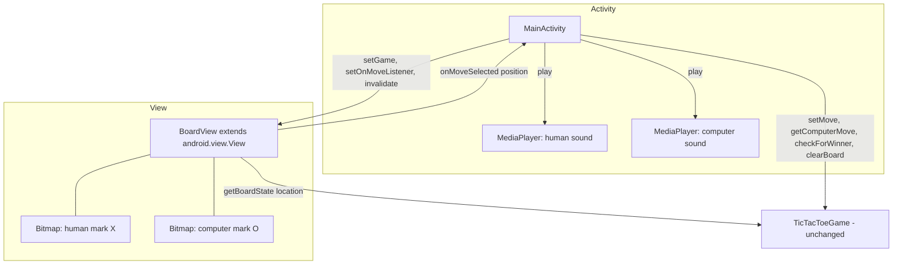
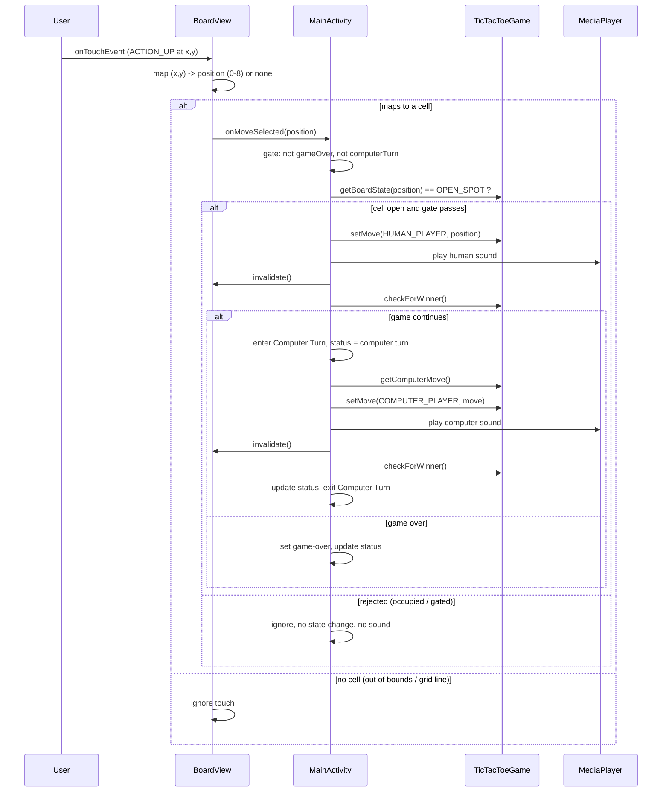

# Design Document

## Overview

This feature replaces the button-based 3x3 board (`TableLayout grid_layout` with buttons `one`..`nine`) with a single custom `BoardView` that extends `android.view.View` and draws the grid and player marks directly on a `Canvas`. Player marks (X and O) are rendered from image drawables, touches are mapped to a board position (0-8) in row-major order, and each valid move plays a sound effect through `MediaPlayer`.

The existing pure game engine `TicTacToeGame` is kept unchanged, and so is all game-flow behavior currently living in `MainActivity`: human-goes-first, the options menu (new game / AI difficulty / quit) and its dialogs, difficulty handling, winner detection, and the information `TextView` status updates.

**Minimal-change principle.** Only changes strictly required by the drawn interface are made:

- Add one new class `BoardView` in package `co.edu.unal.reto4_tictactoe`.
- Replace the `TableLayout` block in `activity_main.xml` with a `BoardView` element; keep the toolbar and information `TextView` and their `ConstraintLayout` constraints.
- Rework the input path in `MainActivity` from nine `ButtonClickListener` instances to a single `BoardView.OnMoveListener`. The turn-orchestration logic (winner check → computer move → status text → game-over) is preserved almost verbatim, just relocated from `ButtonClickListener.onClick` into the listener callback.
- Add drawable images for X/O and two `res/raw` audio files, plus `onResume`/`onPause` `MediaPlayer` management.
- `TicTacToeGame` is **not** modified. No change is required under Requirement 8.7; if one becomes necessary during implementation it must be documented and limited to the interface need.

`BoardView` deliberately holds **no authoritative game state**. It renders from `TicTacToeGame.getBoardState(int)` and reports candidate cell selections upward through a listener. `MainActivity` remains the single owner of turn order, game-over state, winner evaluation, status text, and sound.

## Architecture

### Responsibility split

| Concern | Owner |
| --- | --- |
| Board rules, move validation, winner detection, computer move, difficulty | `TicTacToeGame` (unchanged) |
| Drawing grid + marks, cell dimension computation, touch→position mapping | `BoardView` |
| Turn order, game-over gating, winner evaluation, status text, sound, lifecycle | `MainActivity` |

`BoardView` never calls `checkForWinner()`, `getComputerMove()`, or drives turn flow. It only:
1. reads cell state via `getBoardState(int)` to know what to draw, and
2. converts a touch into a candidate position and emits it via `OnMoveListener.onMoveSelected(int position)`.

`MainActivity` decides whether that candidate is actually applied (via `TicTacToeGame.setMove`), and everything that follows. This keeps `BoardView` free of game flow (Requirement 5.4, 12.3).

### Component diagram



### Sequence: human move then computer move



The optional 1-second delay (Requirement 13) inserts a `Handler.postDelayed` between "enter Computer Turn" and "getComputerMove()"; see the Optional section under Error Handling / Testing.

## Components and Interfaces

### BoardView (new)

`co.edu.unal.reto4_tictactoe.BoardView extends android.view.View` (Requirement 1.1, 1.2).

Fields:

```java
private Paint mGridPaint;          // grid line style
private Bitmap mHumanBitmap;       // scaled X image
private Bitmap mComputerBitmap;    // scaled O image
private int mCellWidth;            // view width / 3
private int mCellHeight;           // view height / 3
private TicTacToeGame mGame;       // reference only; not owned
private OnMoveListener mListener;  // move callback to MainActivity
private static final int GRID_STROKE = ...; // grid line thickness in px
```

Constructors (Requirement 1.3 — instantiable from XML):

```java
public BoardView(Context context)                    // programmatic
public BoardView(Context context, AttributeSet attrs) // XML inflation
```

Both delegate to a shared `initialize(Context)` that creates `mGridPaint` and decodes the mark bitmaps via `BitmapFactory.decodeResource(getResources(), R.drawable.human_mark)` and `...computer_mark`. Bitmaps are decoded at natural size here and re-scaled to cell size in `onSizeChanged`.

Public API:

```java
public void setGame(TicTacToeGame game)              // Requirement 1.4, 5.1
public void setOnMoveListener(OnMoveListener listener)
public interface OnMoveListener {
    void onMoveSelected(int position);               // position in 0..8
}
```

Overrides:

- `onSizeChanged(int w, int h, int oldw, int oldh)` (Requirement 3.2, 3.3): compute `mCellWidth = w / 3`, `mCellHeight = h / 3`, then produce scaled copies of the mark bitmaps sized to fit inside a cell (with a small inset) using `Bitmap.createScaledBitmap`. Recomputed on every size change so touch mapping and drawing stay consistent across rotation/recreation (Requirement 11.1).
- `onDraw(Canvas canvas)` (Requirement 3.1, 4.2–4.5, 7):
  - Draw two vertical and two horizontal grid lines to split the view into a 3x3 arrangement using `mCellWidth`/`mCellHeight`.
  - For each position `i` in 0..8, read `mGame.getBoardState(i)`; if `HUMAN_PLAYER` draw the human bitmap in cell `i`, if `COMPUTER_PLAYER` draw the computer bitmap, if `OPEN_SPOT` draw nothing. Cell `i` occupies `col = i % 3`, `row = i / 3`, top-left at `(col*mCellWidth, row*mCellHeight)`. Marks are drawn scaled/centered within the cell bounds (Requirement 4.5).
- `onTouchEvent(MotionEvent event)` (Requirement 6): on `ACTION_UP`, map `(x, y)` to a position via the algorithm below. If it resolves to a valid cell, call `mListener.onMoveSelected(position)` and return `true`; otherwise ignore (out of bounds or grid-line band) and return `false`/`super`. `BoardView` does **not** consult game-over/computer-turn state or occupancy — it only reports the candidate cell; `MainActivity` performs gating and occupancy checks. (This keeps the view free of game flow; occupancy is authoritatively checked once in `MainActivity` against `TicTacToeGame`.)

Drawing helpers (illustrative): `private int cellLeft(int col)`, `private int cellTop(int row)`, and a `drawMark(Canvas, Bitmap, int position)`.

### MainActivity (changed)

Removed: `mBoardButtons` array, per-button wiring in `startNewGame`, `ButtonClickListener`, and the button-mutating `setMove(char,int)` body.

Added / changed:

```java
private BoardView mBoardView;
private boolean mGameOver;      // preserved
private boolean mComputerTurn;  // new: true while computer move is being applied
private MediaPlayer mHumanMoveSound;
private MediaPlayer mComputerMoveSound;
```

- `onCreate`: inflate layout, wire toolbar (unchanged), `mBoardView = findViewById(R.id.board_view)`, `mBoardView.setGame(mGame)`, `mBoardView.setOnMoveListener(this::onMoveSelected)`, keep insets listener, call `startNewGame()`.
- `startNewGame()`: `mGame.clearBoard()`, `mGameOver = false`, `mComputerTurn = false`, cancel any pending delayed computer move (optional path), set info text to "human first", `mBoardView.invalidate()` (Requirement 7.3, 8.1).
- `onMoveSelected(int position)` — the relocated turn logic (Requirement 8.2–8.4):
  - If `mGameOver` or `mComputerTurn`: return (Requirement 6.5, 6.6).
  - If `mGame.getBoardState(position) != OPEN_SPOT`: return, no sound (Requirement 6.4, 9.4).
  - `mGame.setMove(HUMAN_PLAYER, position)`; play human sound; `mBoardView.invalidate()` (Requirement 5.2, 7.1, 9.2).
  - `winner = mGame.checkForWinner()`. If `0`: enter computer turn, set status "computer turn", request/apply computer move (directly, or delayed per Requirement 13), play computer sound, `invalidate()`, re-check winner, exit computer turn (Requirement 5.3, 7.2, 9.3).
  - Update info text for continue/tie/human-win/computer-win; set `mGameOver = true` on non-zero (Requirement 8.3, 8.4). Status strings reuse existing `R.string` resources (`turn_human`, `turn_computer`, `result_tie`, `result_human_wins`, `result_computer_wins`).
- Options menu, difficulty dialog, and quit dialog are copied unchanged (Requirement 8.5, 8.6, 12.3).
- `onResume()`: create both `MediaPlayer`s (Requirement 10.1, 10.3).
- `onPause()`: release and null both `MediaPlayer`s (Requirement 10.2, 10.4).

### Layout changes (activity_main.xml)

Replace the entire `TableLayout` (`grid_layout` + buttons) with a fully-qualified custom view, keeping toolbar and information TextView and their constraints (Requirement 2.1, 2.2, 2.3):

```xml
<co.edu.unal.reto4_tictactoe.BoardView
    android:id="@+id/board_view"
    android:layout_width="0dp"
    android:layout_height="0dp"
    android:layout_margin="16dp"
    app:layout_constraintDimensionRatio="1:1"
    app:layout_constraintTop_toBottomOf="@id/information"
    app:layout_constraintBottom_toBottomOf="parent"
    app:layout_constraintStart_toStartOf="parent"
    app:layout_constraintEnd_toEndOf="parent" />
```

A `1:1` dimension ratio keeps the board square in the region the button grid previously occupied.

### Resources (new)

- `res/drawable/human_mark.png` (or `.xml` vector) — X image; `res/drawable/computer_mark.png` — O image (Requirement 4.1). Placeholder names: `human_mark`, `computer_mark`.
- `res/raw/human_move.<ext>` and `res/raw/computer_move.<ext>` — move sounds (Requirement 9.1). Placeholder names: `human_move`, `computer_move`. Any `MediaPlayer`-supported format (e.g., `.wav`, `.mp3`, `.ogg`).

## Data Models

There is no new persistent data model. Authoritative board state stays in `TicTacToeGame` as `char[9]` accessed through `getBoardState(int)` / mutated through `setMove(char,int)` (Requirement 5.1, 5.2, 5.4).

- `BoardView` holds only rendering/mapping data: `mCellWidth`, `mCellHeight`, the two scaled `Bitmap`s, `mGridPaint`, and non-owning references to `mGame` and `mListener`. It stores **no** cell occupancy of its own.
- `MainActivity` holds transient control state: `mGameOver` (boolean) and `mComputerTurn` (boolean), plus the two `MediaPlayer` references (nullable; null when released).

Board position model (row-major):

| position | row | col |
| --- | --- | --- |
| 0,1,2 | 0 | 0,1,2 |
| 3,4,5 | 1 | 0,1,2 |
| 6,7,8 | 2 | 0,1,2 |

## Touch-To-Position Mapping Algorithm

Given a touch at `(x, y)` and current `mCellWidth`, `mCellHeight` (each `= viewDimension / 3`), the board occupies `[0, 3*mCellWidth) x [0, 3*mCellHeight)`.

```
function mapTouch(x, y):
    if mCellWidth <= 0 or mCellHeight <= 0:   # not laid out yet
        return NONE
    if x < 0 or y < 0 or x >= 3*mCellWidth or y >= 3*mCellHeight:
        return NONE                            # out of bounds (Req 6.2)
    col = floor(x / mCellWidth)                # 0..2
    row = floor(y / mCellHeight)               # 0..2
    # Grid-line band handling (Req 6.3): reject touches within
    # GRID_STROKE/2 of an interior boundary so line taps select no cell.
    if isOnGridLine(x, y): return NONE
    return row * 3 + col                        # 0..8, row-major (Req 6.1)
```

`isOnGridLine` treats a band of half the grid stroke width on either side of each interior boundary line as "no cell". Clamping `col`/`row` to `0..2` guards against floating rounding at the far edge. The function is **total**: every input yields either a valid `0..8` position or `NONE`. To make this unit-testable, the core arithmetic is extracted into a pure static helper (see Testing Strategy) that takes `(x, y, cellWidth, cellHeight, gridStroke)` and returns `int` (`-1` for NONE).

## MediaPlayer Lifecycle Strategy

Following Requirement 10 and the standard Android media lifecycle:

- `onResume()`: `mHumanMoveSound = MediaPlayer.create(this, R.raw.human_move); mComputerMoveSound = MediaPlayer.create(this, R.raw.computer_move);` (Requirement 10.1, 10.3).
- `onPause()`: for each player, if non-null call `release()` then set the field to `null` (Requirement 10.2, 10.4 — never retain a released instance).
- Playback helper `playSound(MediaPlayer mp)`: guard `if (mp != null) { if (mp.isPlaying()) { mp.seekTo(0); } mp.start(); }` to avoid use-after-release and to allow rapid repeat plays.
- `MediaPlayer.create(...)` can return `null` if the resource fails to load; all playback is null-guarded so a missing/failed sound never crashes the game (see Error Handling, Requirement 9 robustness).

## Correctness Properties


A property is a characteristic or behavior that should hold true across all valid executions of a system — essentially, a formal statement about what the system should do. Properties serve as the bridge between human-readable specifications and machine-verifiable correctness guarantees.

This project applies property-based testing to the **pure, input-varying** pieces of this feature: touch→position mapping, the per-cell "what to draw" decision, cell-dimension computation, mark scaling, and the move-gating / computer-move orchestration logic. The Canvas pixel output, `MediaPlayer` playback, and lifecycle transitions are UI/side-effect concerns that are harder to unit-test directly; where a property below touches those, it is stated against an extracted pure helper or a spy/fake so it can be exercised deterministically. UI-only and structural criteria are covered by instrumentation, smoke, and example tests in the Testing Strategy instead.

### Property 1: Touch mapping is a total function to a valid cell or none

For any touch coordinate `(x, y)` and any positive cell dimensions, the mapping helper returns either a valid board position in `0..8` or `NONE`; and when `(x, y)` falls strictly inside the interior of the cell at `(row, col)` (not out of bounds and not within a grid-line band), it returns exactly `row * 3 + col` (row-major). Out-of-bounds coordinates and grid-line-band coordinates always return `NONE`.

**Validates: Requirements 6.1, 6.2, 6.3**

### Property 2: A move is applied — and its sound played — exactly when the target cell is open and input is allowed

For any board state, target position `p`, and control flags `gameOver`/`computerTurn`, a mark is written via `TicTacToeGame.setMove` (and the corresponding move sound is played) if and only if `getBoardState(p) == OPEN_SPOT` **and** `gameOver` is false **and** `computerTurn` is false. In every other case the board state is unchanged and no move sound is played. This holds after redraws and while a delayed computer move is pending.

**Validates: Requirements 6.4, 6.5, 6.6, 8.4, 9.4, 11.2, 13.3**

### Property 3: A computer move follows a valid human move exactly once while the game continues

For any game state, when a valid human move has been applied and `checkForWinner()` returns `0` (continue), the app applies exactly one computer move via `setMove(COMPUTER_PLAYER, m)` where `m` is the value returned by `getComputerMove()`; when the human move ends the game (winner code non-zero), no computer move is applied.

**Validates: Requirements 5.3, 8.2**

### Property 4: Board rendering reflects getBoardState exactly

For any board configuration (`char[9]` of `HUMAN_PLAYER`/`COMPUTER_PLAYER`/`OPEN_SPOT`), the per-cell draw decision equals: draw the human mark where the state is `HUMAN_PLAYER`, draw the computer mark where the state is `COMPUTER_PLAYER`, and draw no mark where the state is `OPEN_SPOT`. In particular, a fully open board (as after `clearBoard()`) draws zero marks, and the decision is unchanged by view size or recreation.

**Validates: Requirements 4.2, 4.3, 4.4, 5.1, 7.1, 7.2, 7.3, 11.1**

### Property 5: Cell dimensions tile the board for any size

For any positive view width `w` and height `h`, the computed cell width and height equal `w / 3` and `h / 3`, and the nine cells partition the board region into a 3×3 arrangement of equal-sized cells (up to integer rounding) that covers the drawn board area. Recomputation on size change yields dimensions consistent with the new size.

**Validates: Requirements 3.2, 3.3**

### Property 6: Marks are scaled to fit within their cell

For any positive cell dimensions, each scaled mark bitmap has width no greater than the cell width and height no greater than the cell height, so every mark is drawn within the bounds of its cell.

**Validates: Requirements 4.5**

### Property 7: No released MediaPlayer is ever retained

For any sequence of `onResume`/`onPause` lifecycle transitions, once a `MediaPlayer` has been released its field reference is `null`, so no field ever points to a released instance.

**Validates: Requirements 10.4**

## Error Handling

- **Touch out of bounds** (Requirement 6.2): mapping returns `NONE`; `onTouchEvent` ignores it, no listener callback, no state change.
- **Touch on a grid-line band** (Requirement 6.3): mapping returns `NONE`; ignored as above.
- **Touch on an occupied cell** (Requirement 6.4): `MainActivity.onMoveSelected` checks `getBoardState(p) != OPEN_SPOT` and returns early; no `setMove`, no sound, no redraw.
- **Touch during Game Over** (Requirement 6.5) **or Computer Turn** (Requirement 6.6): gated by `mGameOver`/`mComputerTurn`; returns early with no effect.
- **View not yet laid out** (`mCellWidth`/`mCellHeight` == 0 before first `onSizeChanged`): mapping returns `NONE` and `onDraw` guards against zero-size division; nothing is drawn until a valid size arrives.
- **Bitmap decode failure**: if `BitmapFactory.decodeResource` returns `null`, `onDraw` null-guards each mark draw (skips drawing that mark rather than crashing); this is logged. Marks are expected to be valid resources shipped with the app, so this is a defensive guard.
- **Missing/failed audio** (`MediaPlayer.create` returns `null`): fields stay `null`; `playSound` null-guards, so gameplay continues silently instead of crashing (robustness for Requirement 9).
- **Use-after-release of MediaPlayer**: playback only occurs through `playSound`, which is called on the UI thread; `onPause` nulls the fields after `release()`, and `playSound` null-guards, preventing calls on a released instance (Requirement 10.4).
- **Optional delayed computer move** (Requirement 13): a pending `Handler.postDelayed` callback is cancelled/guarded in `startNewGame` and checked against `mComputerTurn` so a new game or lifecycle change cannot apply a stale computer move.

## Testing Strategy

A dual approach is used: property tests for the pure logic that varies with input, and example / instrumentation / smoke tests for UI, side effects, and structural constraints.

### Extract-for-testability

To make the core logic property-testable without a device, the arithmetic is extracted into pure, static helpers (Java, no Android dependencies) that `BoardView`/`MainActivity` delegate to:

- `BoardGeometry.mapTouch(int x, int y, int cellW, int cellH, int gridStroke) -> int` (`-1` == NONE) — Property 1, 5 support.
- `BoardGeometry.markFor(char state) -> Mark {HUMAN, COMPUTER, NONE}` — Property 4.
- `BoardGeometry.scaledSize(int bitmapW, int bitmapH, int cellW, int cellH, int inset)` — Property 6.
- A move-gating helper `MoveGate.shouldApply(char state, boolean gameOver, boolean computerTurn) -> boolean` — Property 2, 3 support.

These pure helpers live in package `co.edu.unal.reto4_tictactoe` and are covered by JVM unit tests (`app/src/test/...`), so no emulator is needed for the property tests.

### Property-based tests

- Library: **jqwik** (JUnit 5 property testing for Java). Add as a `testImplementation` dependency in `app/build.gradle.kts`. Property-based testing is **not** implemented from scratch.
- Each property test runs a **minimum of 100 iterations** (jqwik `@Property(tries = 100)` or higher).
- Each test is tagged with a comment referencing its design property, format:
  `// Feature: custom-boardview-graphics-sound, Property N: <property text>`
- Coverage:
  - Property 1 → generate `(x, y)` across in-bounds interiors, edges, grid-line bands, and out-of-bounds; assert correct row-major result or `-1`.
  - Property 2 → generate board states + flags; assert `shouldApply` and (via a fake game + sound spy) that `setMove`/sound happen iff allowed.
  - Property 3 → drive `onMoveSelected` with a fake `TicTacToeGame` (scripted `checkForWinner`/`getComputerMove`) and a spy; assert exactly-one computer move when the game continues.
  - Property 4 → generate `char[9]`; assert `markFor` decisions match state for all cells (all-open ⇒ zero marks).
  - Property 5 → generate `w, h > 0`; assert cell dims and tiling.
  - Property 6 → generate cell/bitmap sizes; assert scaled dims fit.
  - Property 7 → generate random `resume`/`pause` sequences against a lifecycle harness with a fake `MediaPlayer` factory; assert no released instance is retained.

### Unit / example tests (JVM)

- Winner-code → status-string mapping for codes 0/1/2/3 (Requirement 8.3).
- `startNewGame` sets human-first status and clears state (Requirement 8.1).
- Difficulty selection sets the enum value for each choice (Requirement 8.6).
- Sound played once on a valid human move and once on a computer move via a mock `MediaPlayer` (Requirement 9.2, 9.3).

### Instrumentation tests (device/emulator)

- Layout inflation: `board_view` present, `grid_layout`/buttons absent, toolbar + information present (Requirements 1.3, 2.1–2.3).
- `setGame` wiring and redraw-on-move (invalidate causes marks to appear) (Requirements 1.4, 7.1, 7.2).
- Grid is drawn into a 3×3 arrangement (draw-call spy or snapshot) (Requirement 3.1).
- Options menu items open their dialogs; game logic unchanged (Requirements 8.5, 12.3 regression).

### Smoke tests

- Mark bitmaps decode non-null (Requirement 4.1); `res/raw` sounds resolve to valid ids (Requirement 9.1).
- `BoardView` is a `View` in the correct package; sources are Java in existing structure (Requirements 1.1, 1.2, 12.1, 12.2).
- `TicTacToeGame` unchanged (diff check) (Requirements 5.4, 8.7).

### MediaPlayer lifecycle checks

- After `onResume`, both players non-null; after `onPause`, `release()` called and fields null; resume-after-pause recreates playable players (Requirements 10.1–10.3, verified with a fake `MediaPlayer` factory or instrumentation).

### Optional (Requirement 13)

- Gating-while-pending is covered by Property 2 (`computerTurn` true rejects touches).
- The ~1s, non-blocking timing is verified by instrumentation (UI stays responsive during the delay; computer move lands after ≈1s) and is clearly marked **OPTIONAL** — the base design applies the computer move synchronously within `onMoveSelected`, and the delay is an additive `Handler.postDelayed` wrapper.

### Manual verification

- Audible human/computer move sounds; no crash when a sound resource is missing (null-guarded); board stays consistent across rotation and app background/foreground.
