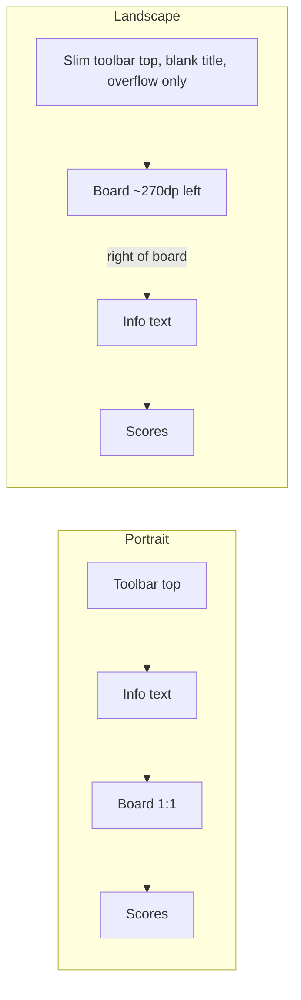

# Challenge 6 Implementation Specification

Feature: `orientation-and-state-persistence`
Module: `app` · Package: `co.edu.unal.reto4_tictactoe` (folder is `Reto5_TicTacToe`, package/app_name say `reto4`/Reto4 — cosmetic, left unchanged)
minSdk 24 · compile/target 37 · Java 11 · Build currently SUCCESSFUL

> This is a **specification only**. It describes what to change and why. It contains **no code patches**. Challenges 1–5 are implemented and working on a physical device; the existing Challenge 5 architecture is preserved and must not be redesigned.

---

## 1. Current Architecture (only C6-relevant parts)

The app is built around a thin Android layer that delegates game rules and flow decisions to small pure (Android-free) helper classes. Challenge 6 extends this layer without disturbing it.

- **`MainActivity`** — the only Android `Activity`. Lifecycle methods present today: `onCreate(Bundle)`, `onResume()`, `onPause()`. **No** `onStart/onStop/onDestroy/onSaveInstanceState/onRestoreInstanceState` exist yet. `onCreate` receives `savedInstanceState` but only forwards it to `super`.
  - Fields: `mGame` (`TicTacToeGame`), `mBoardView` (`BoardView`), `mInfoTextView` (`TextView`), `mGameOver` (`boolean`), `mComputerTurn` (`boolean`, transient gate), `mHumanMoveSound` / `mComputerMoveSound` (`MediaPlayer`).
  - `onCreate`: `EdgeToEdge.enable`, `setContentView(R.layout.activity_main)`, `setSupportActionBar(findViewById(R.id.toolbar))`, applies window insets on `R.id.main`, finds `R.id.information`, constructs `mGame = new TicTacToeGame()`, finds `R.id.board_view`, `setGame`, `setOnMoveListener(this::onMoveSelected)`, `startNewGame()`.
  - `onMoveSelected(int position)`: delegates the whole turn flow to `TurnOrchestrator.onMoveSelected(TurnOrchestrator.adapt(mGame), position, mGameOver, mComputerTurn, soundCue)`. The `SoundCue` lambda: on `HUMAN` → `playSound(mHumanMoveSound)`, sets `mComputerTurn = true`, sets info text to `R.string.turn_computer`; on `COMPUTER` → `playSound(mComputerMoveSound)`; always `mBoardView.invalidate()`. After the call: `mComputerTurn = false`; if `!result.wasApplied()` return; else `mInfoTextView.setText(statusTextResId(GameStatus.statusFor(result.winner())))` and `mGameOver = GameStatus.isGameOver(winner)`.
  - `statusTextResId(GameStatus)` maps the enum to `R.string` (`first_human`, `turn_human`, `turn_computer`, `result_tie`, `result_human_wins`, `result_computer_wins`).
  - `onResume` creates both `MediaPlayer`s (`R.raw.human_move`, `R.raw.computer_move`). `onPause` releases + nulls both.
  - `startNewGame()`: `mGame.clearBoard()`, `mGameOver = false`, `mComputerTurn = false`, info text ← `GameStatus.newGameStatus()`, `mBoardView.invalidate()`.
  - Menu: `onCreateOptionsMenu` inflates `R.menu.options_menu`; `onOptionsItemSelected` handles `R.id.new_game` → `startNewGame()`, `R.id.ai_difficulty` → `showDifficultyDialog()`, `R.id.quit` → `showQuitDialog()`.

- **`TicTacToeGame`** — authoritative model. `char[] mBoard` (size 9), `DifficultyLevel mDifficultyLevel = Expert` (default). Public API relevant here: `clearBoard()`, `setMove(char,int):boolean`, **`getBoardState(int):char`** (single-cell getter), `getDifficultyLevel()`, `setDifficultyLevel(DifficultyLevel)`, `checkForWinner():int` (0 continue, 1 tie, 2 human, 3 computer), `getComputerMove():int`. **There is no full-board getter/setter today.** Challenge 6 adds the full-board `getBoardState():char[]` / `setBoardState(char[])` overloads with **defensive-copy** semantics (both return/store copies) and a **guard** on `setBoardState` (a `null` or non-9-length array leaves the board unchanged) — see Sections 5 and 7.

- **`BoardView`** — holds **no** authoritative state. Renders purely from `mGame.getBoardState(i)` and reports taps through `OnMoveListener`. After a restore, `invalidate()` repaints from the restored game state. **Kept as-is.**

- **`TurnOrchestrator`** (pure) + **`Game`** interface (`getBoardState(int)`, `setMove(char,int)`, `checkForWinner()`, `getComputerMove()`). `onMoveSelected(Game, position, gameOver, computerTurn, SoundCue)` returns `Result(wasApplied, enteredComputerTurn, winner)`. `adapt(TicTacToeGame)` wraps it. `Sound` enum = `HUMAN`/`COMPUTER`. **There is no method that performs only a computer move today.**

- **`GameStatus`** (pure enum): `NEW_GAME_HUMAN_FIRST`, `HUMAN_TURN`, `COMPUTER_TURN`, `TIE`, `HUMAN_WINS`, `COMPUTER_WINS`; `statusFor(int)`, `newGameStatus()`, `isGameOver(int)`.

- **`Difficulty`** (pure): `difficultyFor(int)→DifficultyLevel`, `indexFor(DifficultyLevel)→int`. Indices **0 = Easy, 1 = Harder, 2 = Expert**. Reused for difficulty persistence.

- **`SoundPlayer` / `SoundLifecycle`** — pure seams mirroring `MediaPlayer` lifecycle (used by tests). Not central to C6; untouched.

- **Layout** `res/layout/activity_main.xml`: `ConstraintLayout` (`R.id.main`) with `MaterialToolbar` (`R.id.toolbar`), `information` `TextView` (`R.id.information`, default `R.string.first_human`), `BoardView` (`R.id.board_view`, `0dp`, `app:layout_constraintDimensionRatio="1:1"`, 16dp margin). **No scoreboard TextViews exist.**

- **Menu** `res/menu/options_menu.xml`: `new_game`, `ai_difficulty`, `quit` (all `showAsAction="never"`).

- **strings.xml**: `app_name`, `new_game`, `difficulty`, `quit`, `first_human`, `turn_human`, `turn_computer`, `result_tie`, `result_human_wins`, `result_computer_wins`, `difficulty_choose`, `difficulty_easy/harder/expert`, `quit_confirm_message`, `yes`, `no`, `cancel`. **No score strings exist.**

- Verified **absent today**: `Handler`/`Runnable`/`postDelayed`, `SharedPreferences`, any `onSaveInstanceState`. (Challenge 6 Extra 2 **introduces** a minimal `Handler`+`Runnable` in `MainActivity` for the delayed computer move — see Sections 1 "Key architectural property" and 10.)

### Key architectural property driving the Extra 2 decision
Challenge 5's turn flow is synchronous today: inside a single `TurnOrchestrator.onMoveSelected` call the human move, the computer move, and both winner re-checks all complete before the method returns. For Challenge 6 **Extra 2**, the computer move is now being made **intentionally asynchronous** — a minimal ~1 second (`DELAY_MS`) delay is introduced for the **computer move only** — specifically so the real "Activity recreated between the human move and the computer's reply" scenario is genuinely reproducible and verifiable (otherwise it could never actually happen). This is a deliberate, isolated change to the Challenge 5 synchronous flow:
- It is **confined to `MainActivity`** scheduling (a `Handler` + a named `Runnable` field) plus a **minimal split in `TurnOrchestrator`** so the human move and computer move are applied in two steps instead of one.
- The **pure game logic is unchanged**: the delayed `Runnable`, when it fires, still calls the pure `TurnOrchestrator.playComputerMove(adapt(mGame), soundCue)` to perform the actual move. The `Handler`/`Runnable` is only the scheduling mechanism; `TurnOrchestrator` remains the single source of truth for turn flow.
- Human moves remain **immediate**. Only the computer's reply is deferred by `DELAY_MS`.

The persisted `pendingComputer` flag (Section 10) records that the computer still owes a move, so if the Activity is recreated during the delay window the new Activity reschedules and completes the owed move exactly once.

---

## 2. Requirements Mapping (every C6 requirement → actual files/classes)

| # | Requirement | Maps to |
|---|-------------|---------|
| 1 | Landscape layout | New `res/layout-land/activity_main.xml` keeping a **slim/compact `MaterialToolbar`** (`R.id.toolbar`, blank title) solely to host the options-menu overflow; `MainActivity.onCreate` null-guarded `setSupportActionBar` + `onCreateOptionsMenu`; reuse `R.id.board_view`, `R.id.information` |
| 2 | Save/restore Activity state via `onSaveInstanceState` + `onCreate` | New `MainActivity.onSaveInstanceState(Bundle)`; restore branch in `onCreate` |
| 3 | Full-board serialization | New `TicTacToeGame.getBoardState():char[]` + `setBoardState(char[])` (overloads distinct from existing `getBoardState(int)`) |
| 4 | Turn restoration | `MainActivity.mComputerTurn` + new persisted pending-computer flag; replayed via `TurnOrchestrator` |
| 5 | Score management | New `MainActivity` fields `mHumanWins/mComputerWins/mTies`; new `displayScores()`; increment in `onMoveSelected` winner path; score `TextView`(s) in both layouts |
| 6 | SharedPreferences `"ttt_prefs"` for scores | `MainActivity` load in `onCreate`, save in `onStop` |
| 7 | Reset Scores menu item; remove Quit | `res/menu/options_menu.xml`; `MainActivity.onOptionsItemSelected`; new `resetScores()` |
| 8 (Extra 1) | Persist difficulty as int | `"ttt_prefs"` int key; reuse `Difficulty.indexFor/difficultyFor`; applied after `new TicTacToeGame()` |
| 9 (Extra 2) | Minimal **delayed** computer move (~1s) + persisted pending-computer flag | `MainActivity` `Handler` + named `Runnable` field (`mComputerMoveRunnable`), `DELAY_MS` constant, `postDelayed`/`removeCallbacks`; new `TurnOrchestrator.applyHumanMove(...)` + `playComputerMove(Game, SoundCue):Result`; rescheduled in `onCreate` restore when the flag is set |
| 10 | Lifecycle additions | `onSaveInstanceState` (transient game state), `onStop` (persistent scores/difficulty); `MediaPlayer` stays in `onResume`/`onPause` |
| 11 | Preserve Challenge 5 | Sounds, difficulty dialog, board rendering unchanged; the **only** intentional turn-flow change is the minimal ~1s computer-move delay for Extra 2 (Section 10) |
| 12 | Minimal verification | 7 manual tests (Section 12) |
| 13 | Acceptance criteria | 12-point checklist (Section 13) |

---

## 3. Files to Modify (with why)

1. **`app/src/main/java/.../MainActivity.java`** — add state save/restore, scores, SharedPreferences, the **delayed computer move** (`Handler` + `mComputerMoveRunnable` field + `DELAY_MS`, scheduled on human move, cancelled in lifecycle teardown, rescheduled on restore), the `mGoFirst` field, menu changes, and lifecycle methods. This is the bulk of C6; everything else is a small, well-scoped seam.
2. **`app/src/main/java/.../TicTacToeGame.java`** — add full-board `getBoardState()` / `setBoardState(char[])` so the board can be serialized into the `Bundle` without `BoardView` ever holding state.
3. **`app/src/main/java/.../TurnOrchestrator.java`** — add `applyHumanMove(Game, position, SoundCue):Result` (applies **only** the human move) and `playComputerMove(Game, SoundCue):Result` (applies **only** the computer move) so the turn can be split into an immediate human step and a deferred computer step **without** either step replaying the other. Keeps `TurnOrchestrator` the single source of truth for turn flow; the existing `onMoveSelected` remains for reference but the delayed design drives the two pure sub-steps directly.
4. **`app/src/main/res/layout/activity_main.xml`** (portrait) — add score `TextView`(s); portrait must keep working unchanged otherwise.
5. **`app/src/main/res/menu/options_menu.xml`** — add `reset_scores`, remove `quit`.
6. **`app/src/main/res/values/strings.xml`** — add score label strings and `reset_scores`. `quit` / `quit_confirm_message` strings may remain (harmless) or be removed; this spec keeps them to minimize churn and simply stops referencing them.

> `BoardView.java`, `GameStatus.java`, `Difficulty.java`, `Game.java`, `SoundPlayer.java`, `SoundLifecycle.java` are **not modified**. `Difficulty` and `GameStatus` are reused as-is.

---

## 4. Files to Create (only if clearly beneficial)

1. **`app/src/main/res/layout-land/activity_main.xml`** — the landscape variant (Requirement 1). Required: Android selects it automatically in landscape; same view IDs mean zero code branching for view lookup.

No other new files. No new classes are needed — the pure helpers already exist and are extended minimally.

---

## 5. State Model

Four distinct state categories, kept with separate responsibilities so each survives exactly the right boundary:

| Category | Lives in | Survives | Does NOT survive | Owner |
|----------|----------|----------|------------------|-------|
| **Transient game state** (board, game-over, status, scores snapshot, `mGoFirst`, turn, pending-computer flag) | `savedInstanceState` `Bundle` | Configuration change / Activity recreation (rotation) | Process death without saved bundle (fresh start) | `MainActivity.onSaveInstanceState` / `onCreate` |
| **Authoritative board** | `TicTacToeGame.mBoard` | In-memory; serialized into the bundle via `getBoardState()`/`setBoardState()` (both use **defensive copies** — see below) | — | `TicTacToeGame` |
| **Persistent scores + difficulty** | SharedPreferences `"ttt_prefs"` | App restarts / process death / cold start | A user "Reset Scores" (scores only) | `MainActivity` `onCreate` (load) / `onStop` (save) |
| **Turn / pending-computer state** | `mComputerTurn` (transient) + a persisted `pendingComputer` boolean in the bundle | Rotation (restores whose turn it is) | — | `MainActivity` + `TurnOrchestrator` |

Guiding principle: **`savedInstanceState` = transient per-game state across recreation; SharedPreferences = durable scores + difficulty across app invocations.** The current in-progress game is intentionally *not* persisted to SharedPreferences — only scores and difficulty are.

**Full-board serialization semantics (defensive copies).** The authoritative board crosses the `TicTacToeGame` boundary only through copies, so no caller can mutate the model's internal array by holding a reference:
- `getBoardState():char[]` returns a **defensive copy** of all 9 cells (index order 0..8). Mutating the returned array never affects the internal board.
- `setBoardState(char[])` replaces the internal board with a **defensive copy** of the caller's array; mutating the caller's array afterward never affects the internal board.
- `setBoardState(char[])` is **guarded**: if the argument is `null` or its length is not exactly 9, the internal board is left **unchanged** (no partial write). This guard is what makes the invalid-restore fallback in Section 7 safe.

**Transient Activity state fields in `MainActivity`:** `mGameOver`, `mComputerTurn`, `pendingComputer`, `mStatus` (current `GameStatus`), the score snapshot fields (`mHumanWins/mComputerWins/mTies`), and **`mGoFirst`** (`boolean`, who takes the first move). `mGoFirst` defaults to `true` (human first); the project today has no UI or logic for choosing who goes first, so this field only **preserves** that state across recreation — no new behavior is added. It is the single who-goes-first representation in the app.

---

## 6. Landscape Layout Plan

New file `res/layout-land/activity_main.xml`, derived from the portrait layout, with these differences:

- **Slim/compact `MaterialToolbar` at the top (`R.id.toolbar`).** The landscape layout **keeps** a toolbar, but a minimal one: it has a **blank/empty title** (no app-name text) and exists **solely to host the options-menu overflow (3-dot) button**. It is pinned to the top of the screen and occupies minimal height — a **measured height of no more than 56dp** — so it does not act as a full title bar and does not consume the main content area.
- **Board on the left**, `270dp × 270dp` (**±10dp** tolerance; a fixed size rather than `0dp` ratio, so it does not consume the full width), with its **start edge constrained to the start** of the content area below the slim toolbar/top.
- **Information + score TextViews on the right** of the board, stacked vertically, constrained to the end of the board and the end of the parent.
- Same **`R.id.toolbar`**, **`R.id.board_view`** and **`R.id.information`**, plus the same score `TextView` id(s) as portrait, so `MainActivity.findViewById(...)` needs no landscape-specific branching.
- Style/functionality preserved: `BoardView` still renders from `mGame`, information text still shows status.

### Interpreting "remove the title bar" (why a slim toolbar, not none)
Challenge 6 asks to **remove the title bar** in landscape. This is interpreted as **"do not show the large title/app-name bar"**, *not* "remove every menu affordance." An earlier revision of this spec omitted the toolbar entirely and relied on `onCreateOptionsMenu` alone, assuming the overflow menu would stay reachable. That assumption is **not reliable**: with no `Toolbar` set as the support action bar and no visible `ActionBar`, there is **no overflow affordance for the user to tap**, so New Game / Difficulty / Reset Scores would be **unreachable** in landscape.

**Chosen, reliable mechanism:**
- Keep a slim `MaterialToolbar` with an empty title in landscape purely to host the overflow button. This satisfies the "remove the large title bar" intent (no app title shown, minimal vertical footprint) while guaranteeing the required menu items remain reachable.
- `onCreate` keeps `setSupportActionBar(toolbar)` wired to whatever `R.id.toolbar` is present, with the **null-guard retained for safety** (`if (toolbar != null) setSupportActionBar(toolbar);`). Because `R.id.toolbar` now exists in **both** layouts, `onCreateOptionsMenu`'s items appear in that toolbar's overflow in **both** orientations.
- **How the user accesses the menu in landscape:** by tapping the **overflow (3-dot) button in the slim landscape toolbar** — identical interaction to portrait.

**Alternatives not chosen (and why):**
- *Rely on a hardware/soft "menu" key:* unreliable — modern devices generally have no dedicated menu key, so the items could be unreachable.
- *Floating/anchored on-screen button:* more intrusive and inconsistent with the portrait overflow interaction; adds UI the challenge does not ask for.

### Layout footprint
The slim toolbar sits at the top and takes minimal height (**≤ 56dp**), so the board can still be `270dp` (**±10dp**) on the **left** with information + scores stacked on the **right** — the arrangement is unaffected. Portrait behavior is **unchanged**: `R.id.toolbar` is present there exactly as before and `setSupportActionBar` runs identically (the only difference versus the old spec is that the null-guard is now defensive rather than load-bearing, since the toolbar exists in both orientations).



---

## 7. State Save/Restore Design (what saved, where, when restored; exact bundle keys)

### What is saved — `MainActivity.onSaveInstanceState(Bundle outState)`
Called by the framework before recreation. Saves the transient per-game state:

| Bundle key (constant) | Type | Source | Notes |
|---|---|---|---|
| `KEY_BOARD` = `"board"` | `char[]` | `mGame.getBoardState()` | All 9 cells (`putCharArray`) |
| `KEY_GAME_OVER` = `"gameOver"` | `boolean` | `mGameOver` | `putBoolean` |
| `KEY_STATUS_ORDINAL` = `"statusOrdinal"` | `int` | ordinal of the currently displayed `GameStatus` | Store the **enum ordinal** (valid range **0..5** — `GameStatus` has 6 values), not the localized string (see justification) |
| `KEY_HUMAN_WINS` = `"humanWins"` | `int` | `mHumanWins` | snapshot so rotation shows live scores immediately |
| `KEY_COMPUTER_WINS` = `"computerWins"` | `int` | `mComputerWins` | |
| `KEY_TIES` = `"ties"` | `int` | `mTies` | |
| `KEY_GO_FIRST` = `"goFirst"` | `boolean` | `mGoFirst` | who goes first; **defaults to `true`** (human first) on a fresh start. The app has no UI to change it — this only preserves the state across recreation. Single who-goes-first representation. |
| `KEY_COMPUTER_TURN` = `"computerTurn"` | `boolean` | `mComputerTurn` | whose turn it currently is |
| `KEY_PENDING_COMPUTER` = `"pendingComputer"` | `boolean` | pending-computer flag | the Extra-2 flag (Section 10) |

**Why store the status ordinal, not the localized string:** the information text is a localized `R.string` lookup. Persisting the resolved string would freeze the current locale's text into the bundle; if the configuration change that triggers recreation is itself a **locale change**, the restored string would be stale/wrong. Persisting the `GameStatus` ordinal keeps the state **semantic**; on restore we re-resolve it through `statusTextResId(...)`, so it always renders in the current locale. The ordinal is stable within a build.

> To keep the status representation robust, `MainActivity` tracks the current `GameStatus` (e.g. a `mStatus` field updated wherever the info text is set) so `onSaveInstanceState` can read its ordinal directly. This is a small, local addition.

### Where restore happens — `MainActivity.onCreate(Bundle savedInstanceState)`
`onCreate` branches:

- **Fresh start** (`savedInstanceState == null`): behave exactly as today — construct `mGame`, apply persisted difficulty + load persisted scores (Sections 8–9), default `mGoFirst = true`, then `startNewGame()`.
- **Recreation** (`savedInstanceState != null`): after wiring views and constructing `mGame`:
  0. **Validate the bundle first (invalid-restore fallback).** Read `char[] board = savedInstanceState.getCharArray(KEY_BOARD)` and `int ordinal = savedInstanceState.getInt(KEY_STATUS_ORDINAL, ...)`. **IF** `board == null` **OR** `board.length != 9` **OR** `ordinal` is outside `0..5` **THEN** treat the bundle as invalid and **start a fresh game** (default `mGoFirst = true`, `startNewGame()`) exactly as the fresh-start branch does — do **not** apply any of the partial restored state. Otherwise continue with steps 1–6 below. (The `setBoardState` guard in Section 5 is a second line of defence, but `onCreate` makes the fallback explicit so an invalid status ordinal or board also yields a clean fresh game rather than a half-restored one.)
  1. `mGame.setBoardState(board)` — restore all 9 cells (array already validated non-null, length 9).
  2. `mGameOver`, `mComputerTurn`, `pendingComputer`, `mGoFirst` ← bundle booleans (`mGoFirst` via `getBoolean(KEY_GO_FIRST, true)`).
  3. `mHumanWins/mComputerWins/mTies` ← bundle ints; call `displayScores()`.
  4. Re-resolve status: `GameStatus status = GameStatus.values()[ordinal]` (ordinal already validated in `0..5`); `mInfoTextView.setText(statusTextResId(status))`; set `mStatus = status`.
  5. `mBoardView.invalidate()` — repaint from restored `mGame` state.
  6. If `pendingComputer` is set (and `!mGameOver`) → **reschedule** the delayed computer move on the new Activity's `Handler` (Section 10).

```mermaid
sequenceDiagram
    participant FW as Android Framework
    participant A1 as MainActivity (old)
    participant B as Bundle
    participant A2 as MainActivity (new)
    participant G as TicTacToeGame
    participant BV as BoardView

    FW->>A1: onSaveInstanceState(outState)
    A1->>B: board, gameOver, statusOrdinal, scores,<br/>goFirst, computerTurn, pendingComputer
    FW->>A1: onPause (removeCallbacks + release MediaPlayers)
    FW->>A2: onCreate(savedInstanceState=B)
    A2->>G: new TicTacToeGame(); setBoardState(board)
    A2->>A2: restore flags + scores + mGoFirst; mStatus from ordinal
    A2->>BV: invalidate() (repaint from G)
    A2->>A2: if pendingComputer -> reschedule delayed move (Sec 10)
    FW->>A2: onResume (recreate MediaPlayers)
```

---

## 8. Score Persistence Design (SharedPreferences keys, save timing, restoration)

- **File:** `getSharedPreferences("ttt_prefs", MODE_PRIVATE)`.
- **Keys:** `PREF_HUMAN_WINS = "humanWins"`, `PREF_COMPUTER_WINS = "computerWins"`, `PREF_TIES = "ties"` (all `int`, default `0`).
- **Fields in `MainActivity`:** `int mHumanWins, mComputerWins, mTies`.
- **Increment point:** in `onMoveSelected`, inside the existing winner-handling branch (after `result.wasApplied()`), using `result.winner()`: `2` → `mHumanWins++`, `3` → `mComputerWins++`, `1` → `mTies++`. Only increments when the game actually ends (winner ∈ {1,2,3}); `0` does nothing. After incrementing, call `displayScores()`.
- **`displayScores()`** is the **single UI update point** for scores — it formats the three ints into the score `TextView`(s) and is called from: restore (Section 7), load-at-startup, every game-end increment, and `resetScores()`.
- **Restoration (startup):** in `onCreate` (both fresh and recreation paths), read the three prefs into the fields, then `displayScores()`. On recreation, the bundle snapshot (Section 7) also carries scores so the UI is correct even before the next `onStop`; the prefs and bundle agree because both are written from the same fields.
- **Save timing — `onStop()`:** persist the three ints (and difficulty, Section 9) with `SharedPreferences.Editor` in `onStop`.
  - **Why `onStop`, not `onPause`:** `onPause` already owns a distinct responsibility — releasing the two `MediaPlayer`s — and runs on every transient pause. `onStop` runs when the Activity is no longer visible (including right before process death in normal flows) and is the conventional place to flush durable state. Separating concerns keeps `onPause` focused on audio resources and `onStop` focused on persistence. Scores also live in `savedInstanceState` for the rotation case, so using `onStop` for the durable copy loses nothing across rotation.

---

## 9. Difficulty Persistence Design (enum ↔ int)

- **Key:** `PREF_DIFFICULTY = "difficulty"` (`int`, in the same `"ttt_prefs"` file).
- **Encode:** store `Difficulty.indexFor(mGame.getDifficultyLevel())` (0 = Easy, 1 = Harder, 2 = Expert) — written in `onStop` alongside scores, and **immediately** when the difficulty dialog changes it (so a crash before `onStop` does not lose the choice).
- **Decode / apply order (critical):** `TicTacToeGame`'s constructor defaults `mDifficultyLevel = Expert`. To avoid resetting to Expert on every creation:
  1. `mGame = new TicTacToeGame();`
  2. Read `int idx = prefs.getInt(PREF_DIFFICULTY, Difficulty.indexFor(DifficultyLevel.Expert));` (default preserves today's Expert default on very first run).
  3. `mGame.setDifficultyLevel(Difficulty.difficultyFor(idx));`
  This runs in **both** `onCreate` branches, **after** constructing `mGame` and before `startNewGame()` / restore. The difficulty dialog continues to use `Difficulty.indexFor` for preselect and `Difficulty.difficultyFor` on choice — unchanged — and additionally writes the pref immediately on selection.

---

## 10. Pending Computer Move Design (Extra 2, minimal delayed computer move)

**Decision (revised):** to make Extra 2 **actually testable**, the computer move is given a **minimal, isolated delay** so the real "Activity recreated between the human move and the computer's reply" scenario is genuinely reproducible. The human move stays immediate; only the computer's reply is deferred by a single constant `DELAY_MS` **= `1000` ms (1 second)**, with an acceptable scheduling tolerance of **950..1050 ms**. The delay is implemented with a `Handler` tied to the main `Looper` and a **named `Runnable` field** `mComputerMoveRunnable` on `MainActivity`. This is confined to the Android layer (`MainActivity` scheduling); the pure game logic in `TurnOrchestrator` is unchanged — the `Runnable`, when it fires, calls the pure `TurnOrchestrator.playComputerMove(adapt(mGame), soundCue)`.

### The flag
A single boolean `pendingComputer` means "the computer still owes a move for the current turn." It is persisted as `KEY_PENDING_COMPUTER` in the bundle. It is set the instant the human move is applied and the game continues, and cleared when the computer's deferred move completes.

### Splitting the turn (immediate human move, deferred computer move)
Today `TurnOrchestrator.onMoveSelected` applies the human move **and** the computer move in one synchronous call. For the delayed design the turn must be split so the two moves are **not** applied in the same synchronous call:

- **Immediate:** on a human tap, apply **only** the human move, then schedule the computer move.
- **Deferred (`DELAY_MS` later):** the `Runnable` applies **only** the computer move via `TurnOrchestrator.playComputerMove`.

**Chosen option — add a pure `TurnOrchestrator.applyHumanMove(...)`** (option (b)), justified: reusing `onMoveSelected` is not viable because it always also plays the computer move, which is exactly what we need to defer; and faking a "human-only path" in the Activity would move game logic out of `TurnOrchestrator`, breaking the single-source-of-truth invariant. A small pure `applyHumanMove` mirrors the existing `playComputerMove` symmetry (one pure method per half-turn) and stays JVM-testable:

```pascal
FUNCTION applyHumanMove(game: Game, position: Int, sound: SoundCue): Result
  // Drives ONLY the human move — never plays the computer move.
  IF NOT game.setMove(HUMAN_PLAYER, position) THEN
    RETURN Result.ignored()        // cell occupied / invalid; nothing applied
  END IF
  sound.play(HUMAN)
  winner <- game.checkForWinner()
  // enteredComputerTurn is true only if the game continues (computer owes a move)
  RETURN Result(applied=true, enteredComputerTurn=(winner = 0), winner=winner)
END FUNCTION

FUNCTION playComputerMove(game: Game, sound: SoundCue): Result
  // Drives ONLY the computer's move — never applies a human move.
  move <- game.getComputerMove()
  IF move = -1 THEN
    RETURN Result.ignored()        // no cell available; nothing to do
  END IF
  game.setMove(COMPUTER_PLAYER, move)
  sound.play(COMPUTER)
  winner <- game.checkForWinner()
  RETURN Result(applied=true, enteredComputerTurn=false, winner=winner)
END FUNCTION
```

Both methods reuse the exact sub-sequences that already live inside `onMoveSelected`, keeping `TurnOrchestrator` the single source of truth. The Activity never applies a move directly.

### `onMoveSelected` becomes a scheduler (immediate human move + deferred computer move)
```pascal
PROCEDURE onMoveSelected(position)
  IF mGameOver OR mComputerTurn THEN RETURN      // existing gates preserved
  humanResult <- TurnOrchestrator.applyHumanMove(adapt(mGame), position, soundCue)
  IF NOT humanResult.wasApplied() THEN RETURN     // illegal tap: no change
  mBoardView.invalidate()
  mStatus <- GameStatus.statusFor(humanResult.winner())
  mInfoTextView.setText(statusTextResId(mStatus))
  mGameOver <- GameStatus.isGameOver(humanResult.winner())
  IF mGameOver THEN                                // human move ended the game
    applyWinnerToScores(humanResult.winner()); displayScores()
    RETURN                                         // GUARD: do NOT schedule a computer move
  END IF
  // Game continues -> computer owes a move
  mComputerTurn <- true
  pendingComputer <- true
  mInfoTextView.setText(R.string.turn_computer)
  scheduleComputerMove()                           // mHandler.postDelayed(mComputerMoveRunnable, DELAY_MS)
END PROCEDURE
```

The **guard** (`IF mGameOver … RETURN`) ensures a game-ending human move never schedules a computer reply.

### The delayed `Runnable`
`mComputerMoveRunnable` is a **field** (not a fire-and-forget anonymous capture). When it fires it performs the computer half-turn and all UI updates on the Activity that scheduled it:

```pascal
mComputerMoveRunnable = Runnable:
  // Single-shot guard: capture the at-start-of-run condition (pendingComputer was true AND !mGameOver).
  wasPending <- pendingComputer
  pendingComputer <- false                         // clear FIRST so a concurrent save can't reschedule
  IF NOT wasPending OR mGameOver THEN RETURN        // apply only if it was pending AND the game was not over
  result <- TurnOrchestrator.playComputerMove(adapt(mGame), soundCue)
  mComputerTurn <- false
  IF result.wasApplied() THEN
    mStatus <- GameStatus.statusFor(result.winner())
    mInfoTextView.setText(statusTextResId(mStatus))
    mGameOver <- GameStatus.isGameOver(result.winner())
    applyWinnerToScores(result.winner()); displayScores()
  END IF
  mBoardView.invalidate()
```

### Leak avoidance / lifecycle teardown
- `mHandler` is created with the main `Looper`; `mComputerMoveRunnable` is a named field so no anonymous inner `Runnable` captures the Activity beyond its lifecycle.
- In **`onPause`** (alongside the existing `MediaPlayer` release), call `mHandler.removeCallbacks(mComputerMoveRunnable)`. This cancels any still-pending callback **before** the Activity is destroyed, so a recreated Activity's old callback can never fire against the dead instance. (If an inner-class `Runnable` were ever used instead, the same `removeCallbacks` in teardown guarantees it cannot outlive the Activity.)

### Activity recreation + UI ownership (reschedule on restore)
On recreation in `onCreate`, after the state restore (Section 7) and `displayScores()`, if `pendingComputer && !mGameOver` the **new** Activity reschedules the move on **its own** `Handler`:

```pascal
IF pendingComputer AND NOT mGameOver THEN
    scheduleComputerMove()     // new Activity: mHandler.postDelayed(mComputerMoveRunnable, DELAY_MS)
END IF
```

The elapsed delay is **not** persisted; the new Activity simply reschedules the full `DELAY_MS`. All UI updates (info text, board invalidate, scores) belong to the **new** Activity; the `soundCue` references the new Activity's `MediaPlayer`s (created in its `onResume`). Nothing references the destroyed Activity.

### Answers to the ten pending-move questions
1. **When `pendingComputer` is set** — right after the human move is applied and the game is determined to continue (`checkForWinner() == 0`), so the computer owes a move.
2. **When the delayed callback is scheduled** — immediately after setting the flag, via `mHandler.postDelayed(mComputerMoveRunnable, DELAY_MS)`.
3. **What happens during `onPause`/`onStop` on recreation** — the scheduled callback is cancelled (`removeCallbacks`) so it does not fire against the destroyed Activity; `MediaPlayer` release stays in `onPause` as today (score/difficulty persistence stays in `onStop`).
4. **How the old callback is cancelled/invalidated** — `mHandler.removeCallbacks(mComputerMoveRunnable)` in `onPause`; the `Runnable` is a field, not a fire-and-forget anonymous capture.
5. **What is saved in `savedInstanceState`** — board, `gameOver`, status ordinal, scores, `mGoFirst`, `mComputerTurn`, and `pendingComputer` (that the computer still owes a move). The **elapsed delay is NOT persisted** — on restore the new Activity simply reschedules.
6. **How the new Activity knows the computer must still move** — on recreation, if `pendingComputer` is `true` (and `!mGameOver`), the computer still owes a move.
7. **How the new Activity schedules/performs the computer move** — after restoring state in `onCreate`, if `pendingComputer`, it schedules the **same** delayed `Runnable`, so the new Activity's `Handler` drives `TurnOrchestrator.playComputerMove` with the new Activity's `soundCue`.
8. **How duplicate execution is prevented** — the old callback was cancelled in teardown so it cannot also run; the new Activity schedules exactly one; the `Runnable` clears `pendingComputer` as its first effect and re-checks guards (`pendingComputer && !mGameOver`) before applying, so it runs at most once.
9. **How the pending flag is cleared** — `pendingComputer = false` (first) and `mComputerTurn = false` when the computer move completes inside the `Runnable`, so a subsequent save won't reschedule.
10. **How status and scores are updated** — after `playComputerMove` returns, the **new** Activity maps `result.winner()` via `GameStatus.statusFor` → `statusTextResId` → `mInfoTextView`, sets `mGameOver = GameStatus.isGameOver(winner)`, increments the right score (`2`→human, `3`→computer, `1`→tie) through the single `displayScores()` update point, and calls `mBoardView.invalidate()`. All UI updates belong to the new Activity.

### Guarantees (now enforced by the real delayed-callback mechanism)
- **No crash:** the deferred move runs against the live, restored `mGame`; the sound cue uses the new Activity's players (null-guarded in `playSound`).
- **No reference to a destroyed Activity:** `removeCallbacks` in `onPause` cancels the old callback before destruction; the `Runnable` is a field, so no anonymous capture of the old Activity survives.
- **No duplicate computer move:** the old callback is cancelled on teardown, the new Activity schedules exactly one, and the `Runnable` clears `pendingComputer` first and re-checks `pendingComputer && !mGameOver` before applying.
- **Not stuck:** if the flag was set, the rescheduled move completes `DELAY_MS` later and the turn is handed back (`mComputerTurn = false`, status updated).
- **New Activity owns UI updates:** info text, board repaint, and scores are all set by the new Activity after the deferred move.

```mermaid
sequenceDiagram
    participant U as User
    participant A1 as MainActivity (old)
    participant H1 as Handler (old)
    participant A2 as MainActivity (new)
    participant H2 as Handler (new)
    participant TO as TurnOrchestrator
    participant G as TicTacToeGame

    U->>A1: tap cell
    A1->>TO: applyHumanMove(adapt(G), pos, soundCue)
    TO-->>A1: Result(applied, winner=0 continues)
    A1->>A1: pendingComputer=true; mComputerTurn=true; status="computer's turn"
    A1->>H1: postDelayed(mComputerMoveRunnable, DELAY_MS)
    U->>A1: rotate during the delay window
    A1->>H1: onPause -> removeCallbacks(mComputerMoveRunnable) (cancel)
    A1->>A1: onSaveInstanceState(pendingComputer=true, ...)
    A2->>G: onCreate -> restore board + flags (pendingComputer=true)
    A2->>H2: if pendingComputer: postDelayed(mComputerMoveRunnable, DELAY_MS) (reschedule)
    H2->>A2: Runnable fires (pendingComputer=false first; guard ok)
    A2->>TO: playComputerMove(adapt(G), soundCue)
    TO->>G: getComputerMove / setMove(O) / checkForWinner
    TO-->>A2: Result(applied, winner)
    A2->>A2: mComputerTurn=false; update info, scores, invalidate
```

---

## 11. Menu Changes (New Game, Difficulty, Reset Scores, remove Quit)

`res/menu/options_menu.xml`:
- **Keep** `new_game` → `startNewGame()`.
- **Keep** `ai_difficulty` → `showDifficultyDialog()` (now also persists difficulty immediately on selection).
- **Add** `reset_scores` (new string `R.string.reset_scores`, `showAsAction="never"`) → new `resetScores()`.
- **Remove** `quit`. In `onOptionsItemSelected` the `R.id.quit` branch is removed. `showQuitDialog()` and the `quit`/`quit_confirm_message`/`yes`/`no` strings may remain unused (kept to minimize churn) — note that `showQuitDialog` becomes dead code and can optionally be deleted.

`resetScores()`:
1. `mHumanWins = mComputerWins = mTies = 0`.
2. `displayScores()` — update UI immediately.
3. Persist immediately to `"ttt_prefs"` (write the three zeroed ints via `Editor`) so the reset survives even without waiting for `onStop`.

Difficulty is intentionally **not** reset by Reset Scores.

### Challenge 5 preservation (reconciled with Extra 2)
All Challenge 5 behavior — sounds, difficulty dialog, board rendering, and win/tie detection — is preserved. The **only** intentional behavioral change to the C5 turn flow is the introduction of the ~1 s (`DELAY_MS`) computer-move delay for Extra 2 (Section 10): the human move stays immediate and the computer still plays through the pure `TurnOrchestrator`, but its reply is now scheduled on a `Handler` instead of running synchronously in the same call. Everything else about the turn flow is unchanged.

---

## 12. Minimal Verification Plan (the 7 tests)

All manual, on the physical device. No new automated suite.

1. **Orientation + landscape menu** — Rotate during an in-progress game (portrait↔landscape). The board, marks, status text, and scores are preserved; landscape shows board on the left with info + scores on the right and only a **slim toolbar** (blank title) at the top; portrait still shows the normal toolbar. In **landscape**, tap the **overflow (3-dot) button in the slim toolbar** and confirm New Game, Difficulty, and Reset Scores are all reachable. Confirm the menu is reachable the same way in portrait.
2. **Turn restoration** — Make a human move so it's effectively the next turn, rotate, and confirm exactly the correct player is to act — no extra, duplicate, or skipped move, and the game is not stuck.
3. **Computer move around recreation (real delay)** — Make a human move that does **not** end the game; while the ~1 s computer-move delay is running, **rotate before the computer plays**. Confirm the computer completes **exactly one** move after recreation, there is no crash, no duplicate/second computer move, and the status/scores/board updates come from the new screen. Also confirm that a game-**ending** human move does **not** trigger a computer move.
4. **Score persistence** — Win/lose/tie a few games, fully close and reopen the app; scores reappear. Rotate; scores persist.
5. **Difficulty persistence** — Set difficulty to Easy (or Harder), close and reopen the app; the difficulty dialog preselects the saved level and gameplay reflects it. It does **not** silently reset to Expert on relaunch or rotation.
6. **Reset Scores** — Tap Reset Scores; all three counters show 0 immediately; reopen the app and confirm they remain 0.
7. **Regression sanity** — New Game clears the board and status; Difficulty dialog still works; move sounds still play; board rendering unchanged. Quit menu item is gone.

---

## 13. Acceptance Criteria (concise checklist)

1. Rotating the device preserves the full in-progress game (board, game-over, status).
2. Landscape uses `res/layout-land/activity_main.xml`: a slim/compact `MaterialToolbar` (blank title, overflow only) at the top instead of the large title bar, board ~270dp on the left, info + scores on the right; portrait unchanged.
3. The options menu works in both orientations: in landscape the user reaches New Game / Difficulty / Reset Scores via the **overflow button in the slim toolbar**; `setSupportActionBar` is null-guarded and `R.id.toolbar` exists in both layouts.
4. `onSaveInstanceState` saves board (9 cells), game-over, status **ordinal**, scores, `mGoFirst` (`KEY_GO_FIRST = "goFirst"`), turn, and pending-computer flag with the exact keys in Section 7.
5. `TicTacToeGame` gains full-board `getBoardState():char[]` and `setBoardState(char[])`; `BoardView` still holds no state and repaints via `invalidate()`.
6. The computer move is deferred by a minimal `DELAY_MS` (~1 s) via a `Handler` + named `mComputerMoveRunnable`; the human move stays immediate and is applied via `TurnOrchestrator.applyHumanMove`. A game-ending human move does **not** schedule a computer move. After rotation the correct player acts — no duplicate/again/skipped move; never stuck.
7. If a rotation interrupts the delay window, the pending computer move is cancelled on teardown (`removeCallbacks` in `onPause`) and **rescheduled** by the new Activity, running via `TurnOrchestrator.playComputerMove` **exactly once** (single-shot guard: clear `pendingComputer` first + `pendingComputer && !mGameOver` re-check), with no crash and no reference to a destroyed Activity; the new Activity owns UI updates.
8. Scores (`mHumanWins/mComputerWins/mTies`) increment at game end (2→human, 3→computer, 1→tie) and render through the single `displayScores()`.
9. Scores persist in SharedPreferences `"ttt_prefs"`, restored at startup, saved in `onStop`; score `TextView`(s) exist in both layouts.
10. Difficulty persists as an int in `"ttt_prefs"` (via `Difficulty.indexFor/difficultyFor`), applied after constructing `mGame`, and does not reset to Expert on recreation/relaunch.
11. Reset Scores menu item zeroes all three, updates UI immediately, and persists immediately; Quit menu item removed; New Game + Difficulty still work.
12. All Challenge 5 behavior (turn flow, sounds, difficulty dialog, board rendering) is preserved; the project still builds.

### 13.1 Requirements Traceability

Maps each design section/decision to the `requirements.md` requirement(s) it satisfies (Requirements 1–14). Concise, not exhaustive.

| Requirement | Design section(s) / decision |
|---|---|
| 1 — Orientation & landscape layout | §6 (slim `MaterialToolbar` ≤ 56dp, board 270dp ±10dp on the left, info + scores on the right, shared IDs); §4 (new `layout-land/activity_main.xml`) |
| 2 — Menu access both orientations | §6 (null-guarded `setSupportActionBar`, overflow in both layouts); §11 (New Game, Difficulty, Reset Scores; Quit removed) |
| 3 — Transient state save/restore | §5 (State Model); §7 (exact bundle keys, status ordinal 0..5, invalid-restore fallback, `invalidate()` on restore) |
| 4 — Full-board serialization API | §1 & §5 (`getBoardState():char[]` / `setBoardState(char[])` defensive copies + guard); §7 (used in save/restore); §14 step 1 |
| 5 — Turn restoration correctness | §7 (restore `mComputerTurn`/`pendingComputer`); §10 (split turn, single-shot guard, reschedule-on-recreation) |
| 6 — Who-goes-first (`mGoFirst`) | §5 & §7 (`KEY_GO_FIRST="goFirst"`, default `true`, single representation, no UI) |
| 7 — Score management | §8 (`mHumanWins/mComputerWins/mTies`, single `displayScores()` update point, increment on winner 2/3/1) |
| 8 — Score persistence | §8 (`"ttt_prefs"` `PREF_HUMAN_WINS/PREF_COMPUTER_WINS/PREF_TIES`, load in `onCreate`, save in `onStop`) |
| 9 — Reset Scores / Quit removal | §11 (`reset_scores` item + `resetScores()` immediate persist; Quit removed) |
| 10 — Difficulty persistence (Extra 1) | §9 (`PREF_DIFFICULTY` int via `Difficulty.indexFor/difficultyFor`, applied after constructing `mGame`, persisted on dialog change and `onStop`) |
| 11 — Delayed computer move (Extra 2) | §1 (async rationale); §10 (`DELAY_MS=1000ms` 950..1050ms, `Handler`+`mComputerMoveRunnable`, `applyHumanMove`/`playComputerMove`, single-shot guard, reschedule, game-ending guard) |
| 12 — Lifecycle additions | §7 (`onSaveInstanceState`); §8 (`onStop`); §10 (`removeCallbacks` in `onPause`); §3 (lifecycle scope) |
| 13 — Preserve Challenge 5 | §1 & §11 (only intentional change is the ~1s computer-move delay; sounds, difficulty dialog, board rendering, `TurnOrchestrator` single source of truth preserved) |
| 14 — Build success | §14 (implementation order each step independently buildable); §12 test 7 regression + build check |

### 13.2 Testing Strategy

Verification is **minimal and manual**, matching the non-functional constraint (requirements §"Non-Functional" item 4). No large automated suite is introduced.

- **Primary verification:** the **7 manual tests** in §12, run on the physical device. These cover orientation/menu, turn restoration, the delayed computer move around recreation, score and difficulty persistence, Reset Scores, and Challenge 5 regression.
- **Optional focused JVM unit tests (minimal):** the pure additions are JVM-testable without a device and MAY have a few small, focused unit tests if convenient — kept optional to honour the minimal-verification constraint:
  - `TicTacToeGame.getBoardState():char[]` / `setBoardState(char[])` — round-trip equality; defensive-copy isolation (mutating the returned/caller array does not change the model); guard leaves the board unchanged on `null` or non-9-length input.
  - `TurnOrchestrator.applyHumanMove(...)` / `playComputerMove(...)` — each applies only its own half-turn; `applyHumanMove` reports `enteredComputerTurn` only when the game continues; an occupied/invalid cell is ignored.
- **Not in scope:** no new instrumentation suite, no UI-automation harness, and no coverage targets — the manual tests remain the acceptance mechanism.

---

## 14. Implementation Order (safe step-by-step)

Each step is independently buildable and leaves the app working.

1. **`TicTacToeGame`**: add `getBoardState():char[]` and `setBoardState(char[])` (9 cells, **defensive copies** both ways; `setBoardState` **guard**: `null` or non-9-length leaves the board unchanged). Document the overload vs the existing single-cell `getBoardState(int)`. No behavior change yet.
2. **`TurnOrchestrator`**: add pure `applyHumanMove(Game, position, SoundCue):Result` and `playComputerMove(Game, SoundCue):Result`. Each reuses the corresponding sub-sequence already inside `onMoveSelected`; no behavior change to existing callers yet.
3. **Strings + menu + portrait scores**: add `reset_scores` and score label strings; remove `quit` from `options_menu.xml`; add score `TextView`(s) to portrait `activity_main.xml`.
4. **`MainActivity` scores**: add `mHumanWins/mComputerWins/mTies`, `displayScores()`, increment in the winner path, wire `reset_scores` → `resetScores()`, remove the `quit` branch.
5. **SharedPreferences**: add `"ttt_prefs"` load in `onCreate`, save in `onStop`; `resetScores()` persists immediately.
6. **Difficulty persistence**: load int after `new TicTacToeGame()`, apply via `setDifficultyLevel`; persist on dialog change and in `onStop`.
7. **Landscape layout**: create `res/layout-land/activity_main.xml` with a **slim/compact `MaterialToolbar`** (`R.id.toolbar`, blank title, overflow only) at the top, board left, info + scores right, shared IDs; keep `setSupportActionBar` null-guarded in `onCreate` (defensive; `R.id.toolbar` now exists in both layouts).
8. **Save/restore + `mGoFirst`**: add the `mGoFirst` field (default `true`); add `onSaveInstanceState` (board, flags, scores, status ordinal, `KEY_GO_FIRST`); add the recreation branch in `onCreate` (restore board, flags, `mGoFirst`, scores, status ordinal, invalidate); track `mStatus`.
9. **Delayed computer move (Extra 2)**: add the `DELAY_MS` constant, `mHandler` (main `Looper`), and the named `mComputerMoveRunnable` field; split `onMoveSelected` into an immediate `applyHumanMove` step + a scheduled `playComputerMove` (guard: a game-ending human move does not schedule); add `pendingComputer` to save/restore; `removeCallbacks` in `onPause`; **reschedule** on restore when `pendingComputer && !mGameOver`; the `Runnable` clears the flag first, re-checks guards, then updates UI/scores.
10. **Verify**: run the 7 manual tests; confirm the build is still SUCCESSFUL.
